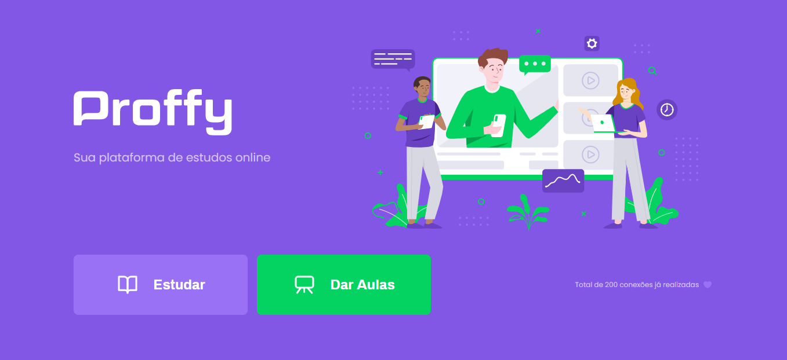

## Proffy - sua plataforma de estudos online

  
    

## 💡 Descrição

Uma plataforma de estudos online, onde os professores podem se cadastrar para dar aulas e os alunos podem pesquisar por disciplina e data os professores disponíveis e entrar em contato através do Whatsapp.
Desenvolvido durante a Next Level Week, um projeto da Rocketseat.

## 🚀 Tecnologias Utilizadas

Front-end:

1. HTML/CSS;
2. Nunjucks;
3. Javascript;

Back-end:

1. Node.js;
2. Sqlite;

## 🎨 Design

Design criado por [Tiago Luchtenberg](https://www.instagram.com/tiagoluchtenberg/)

<table>
  <tr>
    <td></td>
    <td></td>
    <td></td>
    <td></td>
  </tr>
</table>

# 📥 Dependências

1 - npm install express;

2 - npm install nunjucks;

# 📕 Licença

<a href="https://github.com/dxwebster/NLW2-Proffy/blob/master/LICENSE">MIT.</a>
